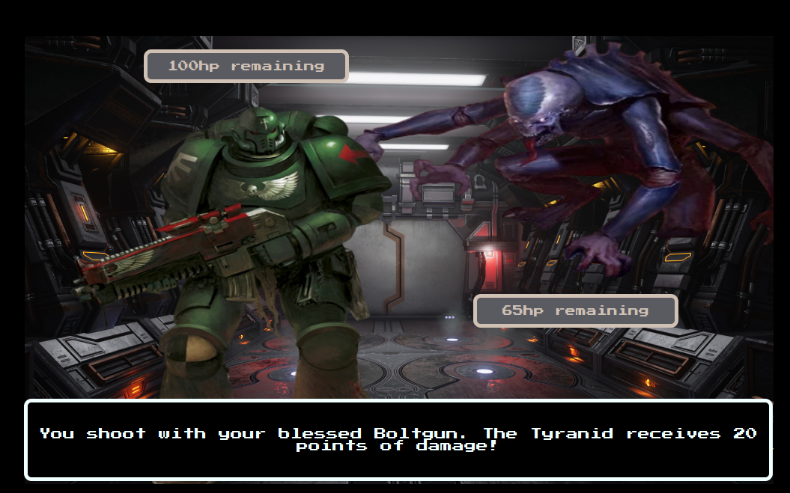

# Without Signals <!--Posible name-->

## Description

You are a Space Marine soldier (from now on Soldier) exploring an base without signals of life... but the truth is terrible and you should escape.

Run across the map, fight for your live and arrive to the exit.

## User stories

- User can move the Soldier left or right on the corridor.
- User can receive an unexpected Tyranid attack on a random position of the corridor.
- User can see the stats (health points, attack strength) of both the Tyranid and the Soldier during the fight.
- User can fight against the Tyranid using the Soldier's attacks.
- User can improve the Soldier's health during the fight.
- User can receive random attacks from the Tyranid (Tyranid can also heal himself).
- User can see random encouraging messages throughout the fight.
- User can go back to the corridor if the Soldier wins the fight, where the Soldier can keep walking towards the exit.
- User can see a win screen when the Soldier arrives to the exit.
- User can see a lose screen if the Tyranid wins.

## Backlog

- User can fight against 3 Tyranids, that attack on random position of the X axis of the corridor. Every Tyranid has random healthpoints and strength.
- User can fight against the Tyranid being able to choose between 4 types of interaction (basic attack, enhanced defense, random damage attack and restoring health points).
- User can see some visual effects in the fight screen.

## File structure

- <code>assets.js</code>: contains all the images and sounds that appear in the game.
- <code>game.js</code>: contains all the elements for the game to work. Methods: start(), \_update(), \_assignControls(), \_displayFightEvent(), amongst others.
- <code>scripts.js</code>: contains all the DOM manipulation code to start the game
- <code>soldier.js</code>: contains all the logic related to the Soldier. Methods: moveLeft(), moveRight(), healthHp(), receiveDamage(), \_generateDamage(), \_selectRandomQuote()
- <code>tyranid.js</code>: contains all the logic related to the Tyranid. Methods: receiveDamage(), \_generateDamage(), \_selectRandomQuote(), tyranidHealth()

## Useful links

<!-- When you finish, add these links and commit -->

- [Presentation slides]()
- [Deployed game]()
